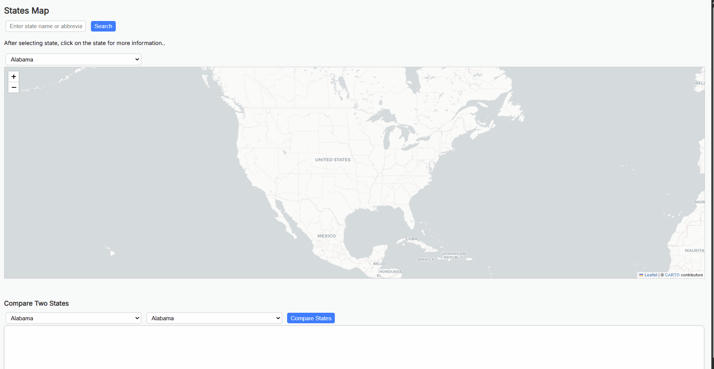

# Flask Leaflet GIS App
An interactive web map that displays U.S. state data from a PostGIS database using Flask and Leaflet.

## Demo




This app allows users to interactively explore U.S. states on a map. 
You can search for a state by name or abbreviation, and the app will display its geographic boundary and details like region and division. 
Data is served from a PostGIS database and displayed using Leaflet.js on the front end.

## Features

- Interactive Leaflet map of all 50 U.S. states
- Search bar and dropdown to query states by name or abbreviation
- Side-by-side comparison tool for two states (2020–2024 population, births, deaths, migration)
- Chart.js bar charts: population & key metrics side-by-side
- CSV-enhanced backend with demographic data joined to spatial queries
- Randomized color fill for selected state
- Flask API serving GeoJSON data with CORS support
- Data from PostGIS + U.S. Census population estimates (2020–2024)

##Tech Stack

- Python + Flask
- PostGIS + SQLAlchemy
- GeoPandas
- Leaflet.js
- Chart.js
- HTML + CSS 

## Getting Started

### 1. Clone repository: 
```bash
git clone https://github.com/YOUR_USERNAME/YOUR_REPO_NAME.git
cd YOUR_REPO_NAME

### 2. Set Up Environment: 
python -m venv venv
source venv/bin/activate  # On Windows: venv\Scripts\activate
pip install -r requirements.txt

### 3. Update Database URL:
In app.py, change the DATABASE_URL to your actual PostGIS connection string.

### 4. Run the app:
python app.py

### 5. View the map:
Open map.html in your browser

*** 
### **6. API Endpoints **

If someone wants to use backend:

## API Endpoints

- `GET /state/<state_name>` – Fetch GeoJSON for a given state.
- `GET /dropdown` – List of all U.S. states.
- `GET /compare` - Compare two states by query string. 
***

## Future Plans

- Add population/migration data as choropleth overlays
- Add time-series comparison for population trends
- Improve error handling and input validation
- Deploy the app to Heroku or Render


Data Sources

    U.S. Census Bureau: State shapefile

    Population estimates CSV from NST-EST2024-ALLDATA
